<div align="center">


<br/>

[](https://brag-better-rag.vercel.app)
[](https://brag-better-rag.onrender.com/api/health)
[](#engineering-proof)
[](#hybrid-rag)
[](#the-evidence-gate)
[](#multi-provider--byok)

<br/>

**[What it is](#what-brag-is)** ·
**[The gate](#the-evidence-gate)** ·
**[Architecture](#architecture)** ·
**[Provenance](#evidence-provenance)** ·
**[Proof](#engineering-proof)** ·
**[Quick start](#quick-start)** ·
**[Status](#implemented-vs-planned)**

</div>

---

## What BRAG is

BRAG — **Better RAG Agent** — is an AI-native investigation layer for software failures. Its agent, **Mechamaru**, is built to answer *why is this actually happening* before anyone asks it to write a patch.

Most AI coding assistants optimise for a single move: error in, fix out. That move fails in a specific and predictable way. The model has your prompt and its own memory, but not your repository, your dependency versions, your runtime, or your deployment configuration — so it produces an explanation that reads well and may be entirely untrue. Debugging then becomes a loop of plausible guesses.

BRAG inverts the order. It retrieves what it knows, decides whether that is genuinely enough, gathers real external evidence when it isn't, correlates the results, and reports a root cause with an explicit confidence level and an explicit trail of where each fact came from.

> **Investigate first. Fix second.**

<br/>

<div align="center">

| Conventional assistant | BRAG |
|---|---|
| Answers from the prompt and model memory | Retrieves from a debugging corpus, then escalates to real evidence |
| Every claim has the same weight | Observed fact, repository fact and inference are labelled separately |
| Confidence is implied by fluency | Confidence is stated, and low confidence is allowed |
| Jumps to a fix | Diagnoses; remediation is opt-in |
| One provider, one point of failure | Central router across configured providers, with BYOK |

</div>

---

## How an investigation works

<div align="center">
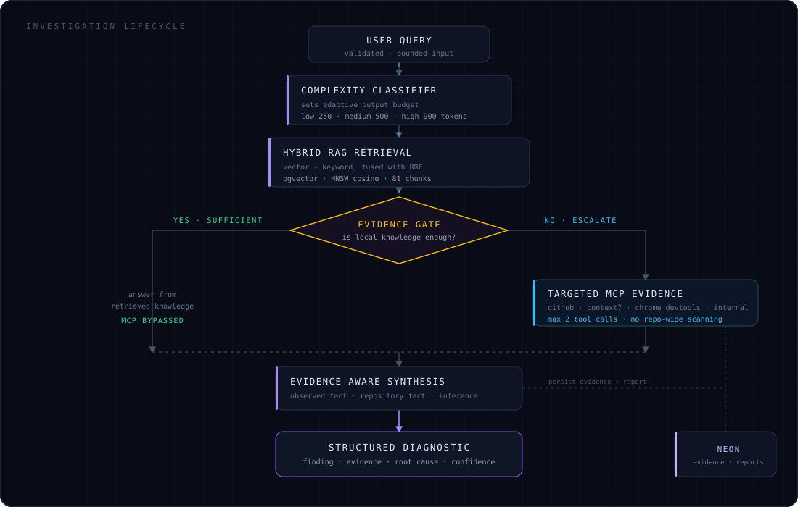
</div>

Every request follows the same spine — validate, classify, retrieve, gate, synthesise, persist. What changes between a trivial question and a hard one is whether the gate opens, and how large a response budget the classifier grants.

---

## The evidence gate

This is the architectural decision the rest of the system is arranged around: **MCP is not invoked for every request.**

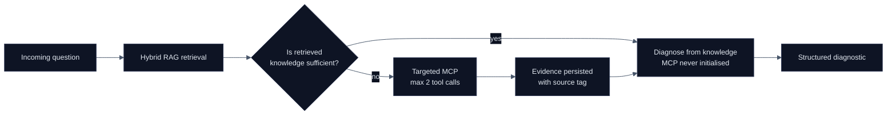

*"What does PostgreSQL error 40P01 mean?"* is answered from the corpus. Nothing external is touched.

*"Investigate the 404 in my deployed repository"* cannot be. The gate opens, and only then does BRAG read the specific repository files, documentation pages or console output it needs.

**Use the cheapest reliable evidence source first, and escalate only when necessary.** That principle is what keeps the agent fast, cheap and predictable — and it is enforced with hard limits, not with prompt instructions alone.

<div align="center">

| Constraint | Value |
|---|---|
| Tool calls per request | `2` (global maximum) |
| Agent steps | `3` |
| MCP initialisation | Conditional — skipped entirely when RAG suffices |
| Repository access | Targeted reads only; no repo-wide scanning |
| Write access during investigation | None — BRAG does not modify the systems it inspects |

</div>

---

## Architecture

<div align="center">
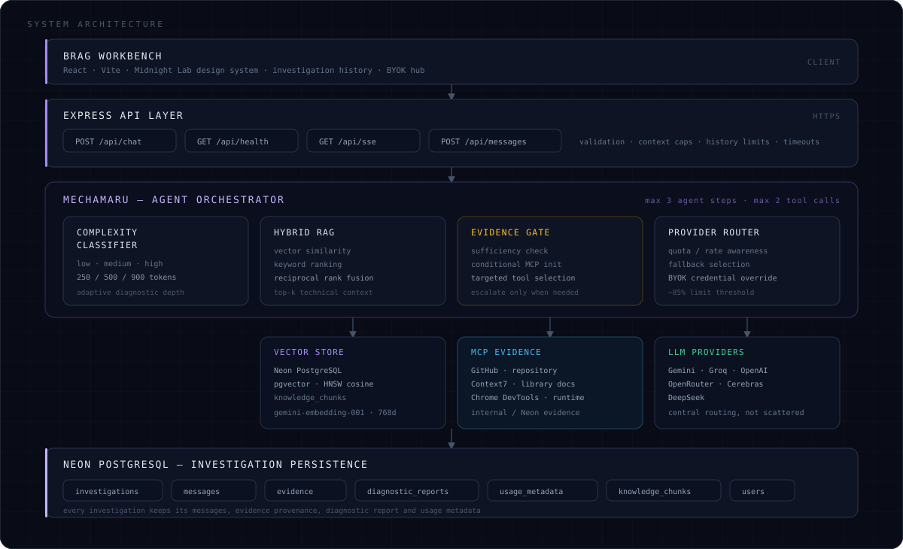
</div>

<details>
<summary><b>API surface</b></summary>

<br/>

| Route | Purpose |
|---|---|
| `POST /api/chat` | Primary investigation endpoint — validation, orchestration, RAG, provider selection, MCP gating, synthesis, persistence |
| `GET /api/health` | Service health and deployment verification |
| `GET /api/sse` | Server-sent event infrastructure |
| `POST /api/messages` | Message persistence and interaction |

</details>

<details>
<summary><b>Safety and cost baselines</b></summary>

<br/>

```text
MAX_USER_MESSAGE_CHARS       2000
MAX_CONTEXT_CHARS            5000
MAX_HISTORY_MESSAGES            8
MAX_OUTPUT_TOKENS             500     ← further refined per-request by the classifier
MAX_AGENT_STEPS                 3
MAX_TOOL_CALLS_PER_REQUEST      2
REQUEST_TIMEOUT_MS          20000
```

Every one of these bounds something that can otherwise run away: context growth, token spend, tool execution, agent loops, request duration.

</details>

---

## Hybrid RAG

<div align="center">
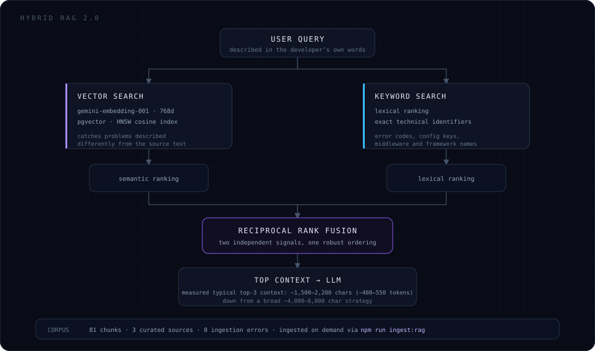
</div>

Pure semantic search is the wrong tool for debugging on its own. Developers describe symptoms loosely — *"my connections keep hanging"* — which vectors handle well. But they also paste exact strings: `40P01`, `ECONNRESET`, a middleware name, a config key. Those are lexical, and embeddings blur them.

BRAG runs both lanes and fuses the rankings with **Reciprocal Rank Fusion**, so a chunk that either lane is confident about survives into the final context.

<div align="center">

| | |
|---|---|
| **Embedding model** | `gemini-embedding-001` |
| **Dimensionality** | `768` |
| **Store** | Neon PostgreSQL + `pgvector`, table `knowledge_chunks` |
| **Index** | HNSW, cosine similarity |
| **Corpus** | 81 chunks across three curated sources |
| **Ingestion** | On demand — `npm run ingest:rag`, not per request |

</div>

The corpus is domain-built rather than scraped: backend fundamentals, auth and security, PostgreSQL, Redis, MongoDB, the Node.js runtime, async and concurrency, networking and microservices, Docker, WebSockets and realtime, middleware errors, environment and configuration, CORS, RAG and AI, plus BRAG's own internals.

**Measured effect on context size.** The typical top-three retrieval assembles roughly **1,500–2,200 characters (~400–550 tokens)** of context, against roughly **4,000–6,000 characters** under the earlier broad-context strategy. Less noise reaching the model, at lower cost per investigation.

---

## MCP evidence layer

When the gate opens, MCP is how BRAG stops guessing and goes and looks.

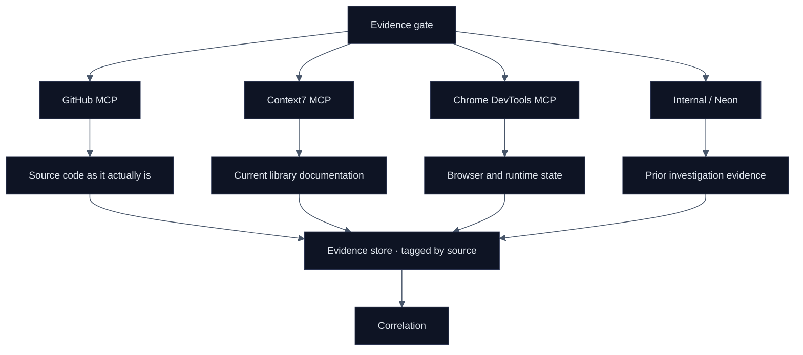

<div align="center">

| Integration | Evidence it supplies | Validated against |
|---|---|---|
| **GitHub MCP** | Repository files, structure, real implementation | `get_file_contents` on a live repository, returning its actual Node/Express/Prisma/PostgreSQL architecture |
| **Context7 MCP** | Current framework and library documentation | A real Prisma query on interactive transactions — returned official docs on timeout, `maxWait` and isolation levels |
| **Chrome DevTools MCP** | Browser console, runtime and deployment behaviour | A real deployed app inspection that surfaced a `404` resource failure and a form-field accessibility warning |
| **Internal / Neon** | Persisted evidence from earlier investigations | Evidence written and retrieved from Neon |

</div>

Evidence is never transient. It is written to the `evidence` table under an explicit source tag:

```text
github_mcp   context7_mcp   chrome_devtools_mcp   internal_mcp   log_mcp   rag
```

Which means an investigation can be audited later: not just what BRAG concluded, but what it looked at to get there.

---

## Evidence provenance

<div align="center">
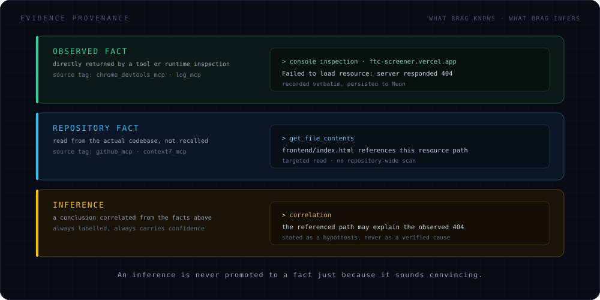
</div>

This distinction exists because of a specific failure. During development, a synthesis pass named a repository file as *the* root cause on evidence that did not support it — a confident-sounding claim built on correlation. The hardening that followed made the three classes structural rather than stylistic, so the agent has to say which kind of statement it is making.

An inference is allowed to be wrong. It is not allowed to arrive dressed as an observation.

---

## Diagnostic intelligence

<div align="center">
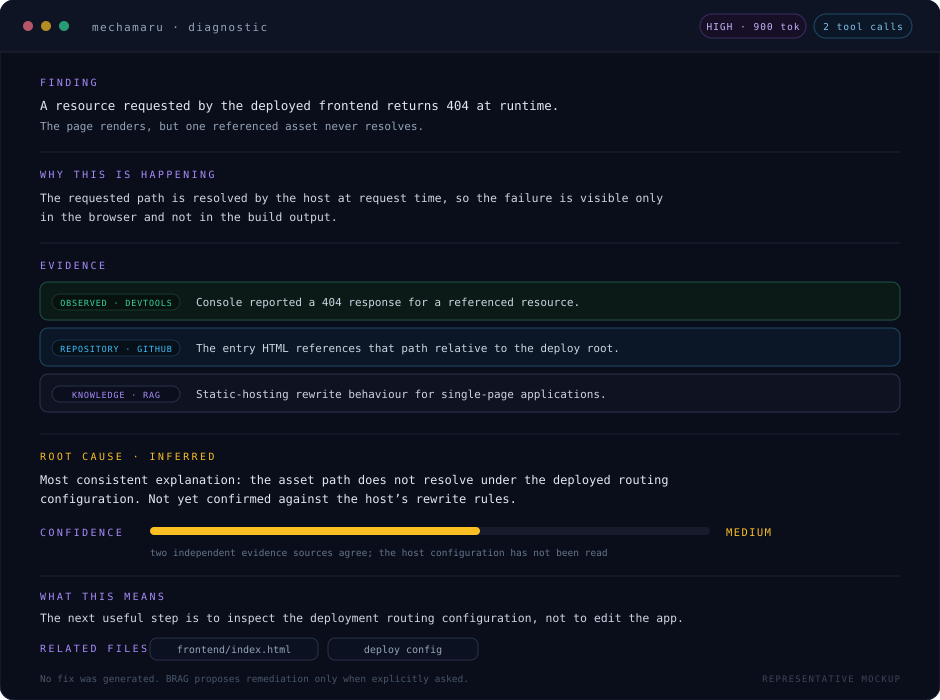

<sub>Representative mockup of the diagnostic structure — not a captured production screenshot.</sub>
</div>

<br/>

Every diagnostic returns the same seven sections — *Finding · Why this is happening · Evidence · Root cause · Confidence · What this means · Related files* — so responses can be compared, reviewed and stored rather than read as prose.

The agent's standing instruction is **identify, don't solve.** It separates *what happened* from *why it happened* from *how to fix it*, and stops after the second unless a fix is explicitly requested.

**Adaptive depth.** A complexity classifier sizes the answer to the question, so a one-line lookup doesn't get a nine-hundred-token essay:

<div align="center">

| Classification | Output budget |
|---|---:|
| `low` | 250 tokens |
| `medium` | 500 tokens |
| `high` | 900 tokens |

</div>

The diagnostic path runs Gemini `gemini-2.5-flash` with `thinkingBudget: 0` and `maxOutputTokens` passed down from the orchestrator — deliberate choices to make output behaviour predictable rather than merely capable.

---

## Multi-provider & BYOK

<div align="center">
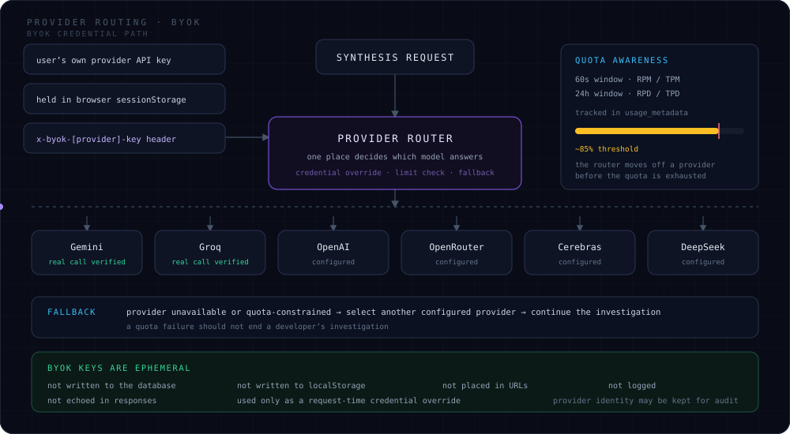
</div>

Two problems solved by one abstraction. First, single-provider outages and quota exhaustion take the whole product down. Second, a centrally funded API key is a hard ceiling on how much anyone can use the tool.

The **provider router** owns the decision of which model answers, in one place instead of scattered across the codebase. It tracks usage in `usage_metadata` across 60-second (RPM/TPM) and 24-hour (RPD/TPD) windows and begins moving off a provider at roughly an **85% threshold** — before the quota is gone, not after.

**BYOK** lets a user supply their own key. It stays ephemeral by design: held in `sessionStorage`, transmitted per-request as `x-byok-[provider]-key`, and used as a credential override at the moment of the call. Raw keys are never persisted to Neon, never written to `localStorage` or a URL, never logged, never echoed back. Only provider identity is retained where audit requires it.

---

## Engineering proof

<div align="center">
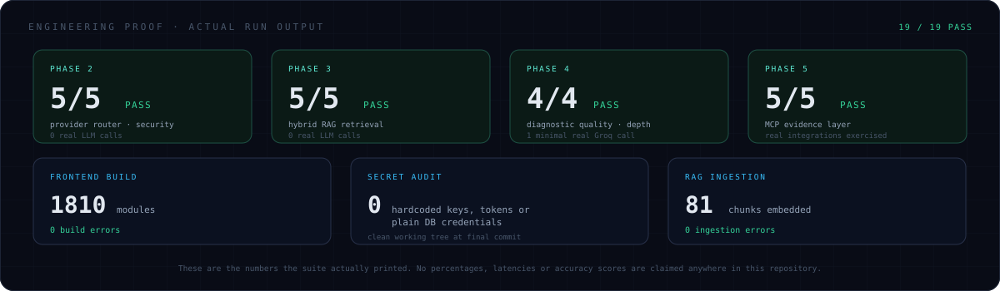
</div>

```bash
npm test              # full suite
npm run test:phase2   # provider router & security
npm run test:phase3   # hybrid RAG retrieval
npm run test:phase4   # diagnostic quality & adaptive length
npm run test:phase5   # MCP evidence layer
```

Tests are written to avoid burning provider quota — phases 2 and 3 run with **zero real LLM calls**, and phase 4 uses a single minimal Groq call to verify response format.

### Validated against real systems

<div align="center">

| | Verified |
|---|---|
| **Gemini** | Minimal real provider call, exact-response verification |
| **Groq** | Minimal real provider and model configuration call |
| **GitHub MCP** | Real repository file retrieval via `get_file_contents` |
| **Context7 MCP** | Real Prisma documentation resolution and retrieval |
| **Chrome DevTools MCP** | Real console inspection of a deployed application |
| **Neon** | Real persistence of MCP evidence and investigation records |

</div>

These are integrations that have been exercised, not adapters that compile.

---

## A worked investigation

```text
▸ USER
  "Investigate the 404 error in my deployed application."

▸ CLASSIFY                              high complexity → 900 token budget

▸ HYBRID RAG                            static-hosting and routing knowledge retrieved
                                        …general, but not about THIS deployment

▸ EVIDENCE GATE                         insufficient → OPEN

▸ GITHUB MCP                            targeted read of the referencing entry file
▸ CHROME DEVTOOLS MCP                   console inspection of the live deployment

▸ PERSIST                               evidence → Neon, tagged by source

▸ CORRELATE
    observed fact      console returned 404 for a referenced resource
    repository fact    the entry file references that path
    inference          the path likely does not resolve under deployed routing

▸ DIAGNOSTIC                            root cause stated · confidence MEDIUM
                                        host routing config not yet read

▸ REMEDIATION                           none — not requested
```

The point of the example is not the 404. It is that the conclusion is decomposable: you can see exactly which line is observation and which is hypothesis, and exactly what would raise the confidence.

---

## Production architecture

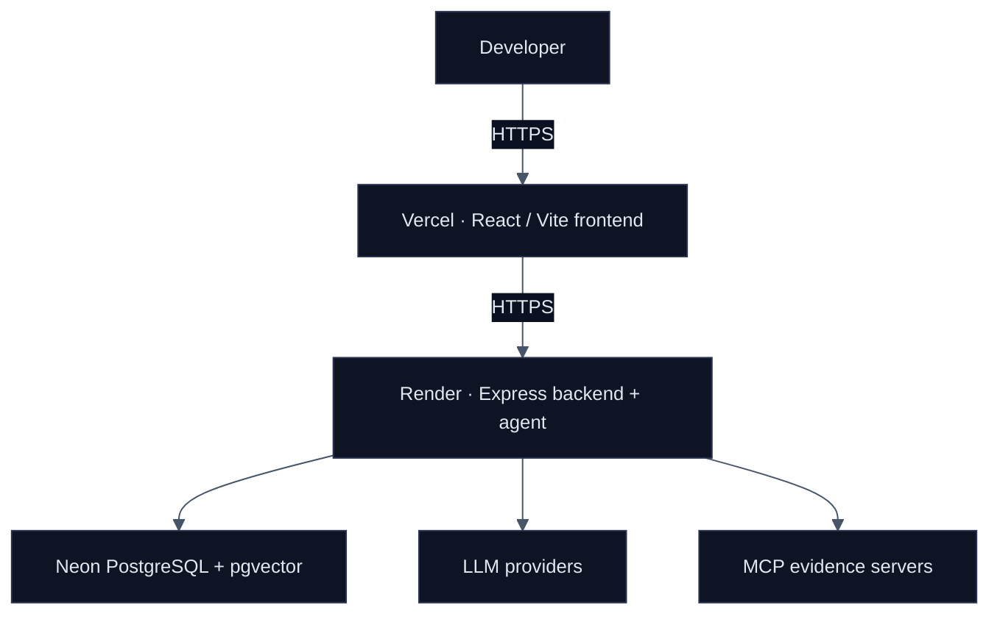

<div align="center">

| Tier | Host | Notes |
|---|---|---|
| Frontend | **Vercel** | root `frontend`, build `npm run build`, output `dist` |
| Backend | **Render** | root `backend`, build `npm install`, start `node server.js`, health `/api/health` |
| Database | **Neon PostgreSQL** | application persistence, evidence, usage metadata, vector corpus |

</div>

Server-side secrets stay server-side. The frontend never receives provider keys or `DATABASE_URL`; the only credentials that cross the boundary are the user's own BYOK keys, and they travel browser → header → memory and stop there. `.gitignore` covers `.env`, `.env.*` and `*.local` while keeping `.env.example` tracked.

---

## Tech stack

<div align="center">


<br/><br/>

**Frontend** · React · Vite · Midnight Lab design system<br/>
**Backend** · Node.js · Express<br/>
**Retrieval** · PostgreSQL · pgvector · HNSW · Gemini embeddings · RRF<br/>
**Models** · Gemini · Groq · OpenAI · OpenRouter · Cerebras · DeepSeek<br/>
**Evidence** · MCP · GitHub · Context7 · Chrome DevTools<br/>
**Infrastructure** · Neon · Vercel · Render

</div>

---

## Quick start

```bash
git clone https://github.com/Vedanto28/BRAG---Better-RAG-.git
cd BRAG---Better-RAG-
```

**Backend**

```bash
cd backend
npm install
cp .env.example .env        # fill in the values below
npm run ingest:rag          # embeds the corpus into pgvector — run once
node server.js
```

**Frontend**

```bash
cd frontend
npm install
npm run dev
```

### Environment

`backend/.env.example` is the authoritative list. In outline:

<div align="center">

| Variable | Scope | Purpose |
|---|---|---|
| `PORT` | backend | Server port (default: 5000) |
| `DATABASE_URL` | backend | Neon PostgreSQL connection |
| `LLM_PROVIDER` | backend | Default primary provider (`gemini`, `groq`, `openai`, `openrouter`, `cerebras`, `deepseek`) |
| `GEMINI_API_KEY` | backend | Gemini generation + embeddings |
| `GROQ_API_KEY` | backend | Groq provider API key |
| `GROQ_MODEL` | backend | Groq model identifier (default: `qwen/qwen3.8-27b`) |
| `OPENAI_API_KEY` | backend | OpenAI provider API key |
| `OPENAI_MODEL` | backend | OpenAI model identifier (default: `gpt-4o-mini`) |
| `OPENROUTER_API_KEY` | backend | OpenRouter provider API key |
| `CEREBRAS_API_KEY` | backend | Cerebras provider API key |
| `DEEPSEEK_API_KEY` | backend | DeepSeek provider API key |
| `GITHUB_MCP` | backend | GitHub personal access token for repository MCP reads |
| `CONTEXT7_MCP` | backend | Context7 API key for documentation MCP lookups |
| `VITE_API_URL` | frontend | Backend API base URL (`http://localhost:5000/api/chat`) |

</div>

Users who don't want to configure server-side provider keys at all can supply their own at runtime through the BYOK hub instead.

---

## Repository structure

```text
BRAG---Better-RAG-
│
├── backend/
│   ├── src/                  agent orchestration · RAG · MCP · provider router · persistence
│   ├── test/
│   │   ├── testProviderRouterAndSecurity.js
│   │   ├── testHybridRagRetrieval.js
│   │   ├── testDiagnosticQualityAndAdaptiveLength.js
│   │   └── testMcpEvidenceLayer.js
│   ├── .env.example
│   ├── package.json
│   └── server.js
│
├── frontend/                 React · Vite · investigation workbench
│   └── package.json
│
├── docs/
│   └── assets/               README visuals (see docs/assets/README.md)
│
├── .gitignore
├── package.json
└── README.md
```

<details>
<summary><b>Database tables</b></summary>

<br/>

```text
users
investigations ──┬── messages
                 ├── evidence
                 ├── diagnostic_reports
                 └── usage_metadata

knowledge_chunks     ← pgvector corpus, HNSW cosine index
```

Neon's own authentication tables are separate and left untouched.

</details>

---

## Implemented vs planned

<table>
<tr>
<th align="left">🟢 Implemented &amp; tested</th>
<th align="left">🔵 Configured</th>
<th align="left">⚪ Future — not built</th>
</tr>
<tr>
<td valign="top">

Express API + Neon persistence<br/>
Investigation / message / evidence models<br/>
Hybrid RAG (vector + keyword + RRF)<br/>
pgvector + HNSW, 81-chunk corpus<br/>
On-demand ingestion pipeline<br/>
Complexity classifier + adaptive budgets<br/>
Structured diagnostic responses<br/>
Evidence-class separation<br/>
Conditional MCP gate + call limits<br/>
GitHub / Context7 / DevTools evidence<br/>
Evidence persistence + source tagging<br/>
Provider router, limits, fallback<br/>
BYOK credential handling<br/>
React / Vite workbench

</td>
<td valign="top">

OpenAI provider<br/>
OpenRouter provider<br/>
Cerebras provider<br/>
DeepSeek provider<br/>
SSE infrastructure<br/><br/>

<sub>Wired through the router; Gemini and Groq are the two verified with real calls.</sub>

</td>
<td valign="top">

Sentry MCP telemetry<br/>
Datadog / OpenTelemetry<br/>
Autonomous evidence graph<br/>
Investigation replay UI<br/>
Diagnosis → remediation handoff<br/>
Patch generation and PR creation

</td>
</tr>
</table>

Nothing in the third column is implemented, partially or otherwise.

---

## Roadmap

<div align="center">
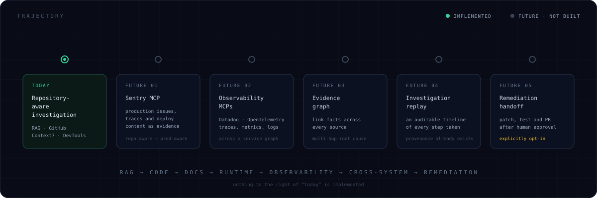
</div>

**Sentry MCP** would be the largest single step — connecting production issues, traces and deployment context turns BRAG from a repository-aware debugger into a production-aware one. **Observability MCPs** extend that across a service graph rather than one repository. An **evidence graph** would let facts from different sources link into multi-hop chains instead of sitting as isolated chunks. **Investigation replay** is nearly free architecturally, since provenance and evidence are already first-class. And **remediation** — patch, test, PR — stays deliberately last, and deliberately gated behind human approval.

---

## Design principles

```text
EVIDENCE BEFORE EXPLANATION      retrieve and observe, then conclude

CHEAPEST SOURCE FIRST            RAG answers what RAG can answer;
                                 MCP is for what it can't

BOUNDED BY CONSTRUCTION          2 tool calls · 3 agent steps ·
                                 capped context · capped output

READ, DON'T WRITE                investigation never modifies the
                                 system under investigation

FACT ≠ INFERENCE                 the agent must say which one it is saying

DIAGNOSIS ≠ REMEDIATION          fixes are requested, not assumed

EPHEMERAL CREDENTIALS            BYOK keys live in memory and die there
```

---

## Scope

BRAG is an actively developed project, not a hardened commercial product. The architecture is real and the numbers on this page came from actual command output — but there are no benchmarks, latency figures, accuracy scores or scale claims here, because none have been measured. The retrieval corpus is domain-curated rather than exhaustive, MCP coverage is four integrations rather than an ecosystem, and diagnostic quality depends on the evidence available for a given failure.

That restraint is the point. A tool built to stop a model from overclaiming has no business overclaiming in its own README.

---

<div align="center">

<br/>

### BRAG

**Better RAG Agent**

`KNOWLEDGE` → `CODE` → `DOCUMENTATION` → `RUNTIME` → `EVIDENCE` → `ROOT CAUSE`

<br/>

**INVESTIGATE FIRST. FIX SECOND.**

<br/>

<sub>An AI investigation layer that gathers, correlates and reasons over software evidence.</sub>

</div>
